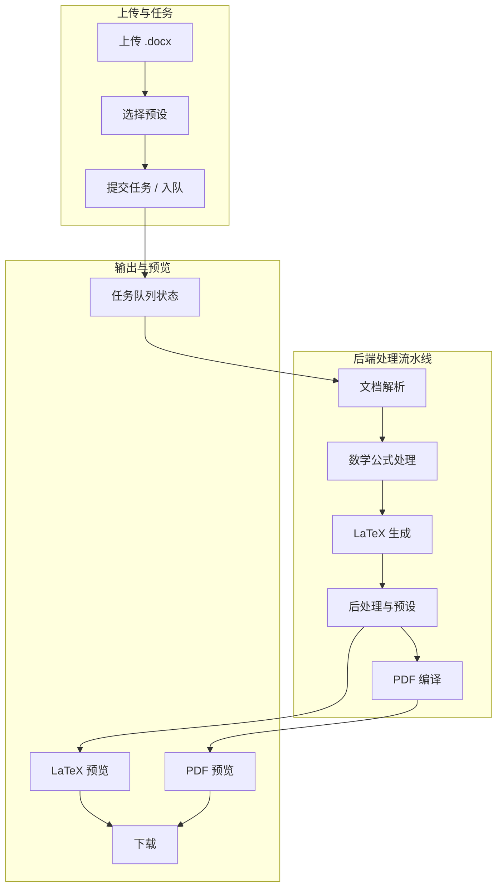

# Word 一键转 LaTeX 网站方案（修订版）

## 1. 前端技术栈（确定）

- **框架**：仅 **Next.js 14+**（App Router），部署 **Vercel**
- **UI 组件库**：**shadcn/ui**（基于 Radix UI + Tailwind，按需拷贝组件、无运行时包袱，与 Vercel 适配好）
- 前端职责：上传 .docx、选择格式预设、发起转换、**转换预览**（见下）、下载 .tex / .zip / PDF

---

## 2. 转换链路：模块与流程总览

---

## 3. 各模块需具体处理的流程

### 3.1 文档解析（Word → 中间结构）

- **输入**：.docx 文件（实为 ZIP，内含 `word/document.xml`、`word/media/` 等）
- **目标**：得到可驱动「LaTeX 生成」的中间表示（段落、标题、表格、图片、公式、列表、样式等）
- **流程要点**：
  - 解压 .docx，读取 `document.xml`（及 styles、numbering 等）
  - 按文档顺序遍历：段落（含样式/大纲级别）→ 表格 → 内嵌对象（图片、OMML 公式）
  - 提取图片到临时目录，记录与段落/表格的对应关系，便于后续 LaTeX 引用
  - 区分正文、标题、题注、页眉页脚（按预设决定是否输出到主 .tex）
- **输出**：结构化数据（如 JSON 或内部 AST），供「数学公式处理」与「LaTeX 生成」使用

### 3.2 数学公式处理

- **输入**：Word 中的公式（OMML 或 2013+ 的 OMML 存储）
- **目标**：得到 LaTeX 数学代码（`$...$` 或 `\begin{equation}...`）
- **流程要点**：
  - 从 document.xml 中定位 `<m:oMath>` 等 OMML 节点
  - 使用 Pandoc 的 OMML→LaTeX 路径（Pandoc 内置 OMML 支持），或先转成 Pandoc AST 再转 LaTeX
  - 对复杂公式做后处理：括号配对（`\left[ \right]`）、`\frac`/矩阵等，必要时做简单正则修复
  - 行内公式与独立公式区分（Word 中「公式」块 → `equation`* 或 `\[ \]`，内联 → `$...$`）
- **难点**：OMML 与 LaTeX 并非一一对应，部分复杂公式需 fallback 或人工校对提示

### 3.3 LaTeX 生成

- **输入**：文档解析结果 + 公式 LaTeX + 预设配置
- **目标**：生成主 .tex 文件（及可选的 .bib、资源清单）
- **流程要点**：
  - 根据预设写入 `\documentclass`、`\usepackage`、必要宏
  - 按顺序输出：标题/作者/摘要 → 正文（段落、标题层级、表格、图片引用、公式）
  - 表格：转为 `tabular`/`longtable` 等；图片：`\includegraphics{文件名}`（无路径，满足 EM 规范）
  - 参考文献：若解析到 citations，生成 .bib 并在 .tex 中 `\bibliographystyle` + `\bibliography` 或 `\input{*.bbl}`

### 3.4 后处理与预设（Aries EM 等）

- **输入**：原始生成的 .tex + 资源文件列表
- **目标**：符合期刊/EM 规范的最终 .tex 与扁平化资源
- **流程要点**：
  - 文件名规范化：仅一个英文句点、无保留名、无特殊字符；图片统一扩展名策略（如统一 .pdf 或 .png）
  - 所有 `\includegraphics` 改为仅文件名，无子路径；资源复制到与 .tex 同层
  - 可选：在 .tex 首行插入 `%!TEX TS-program = xelatex` 或 `% !BIB TS-program = biber`
  - 打 zip 时：仅一层目录，无子文件夹（符合 EM 要求）

### 3.5 PDF 编译

- **输入**：最终 .tex + 同目录下的 .bib、.sty、图片等
- **目标**：生成 PDF 供预览与下载
- **流程要点**：
  - 在隔离环境（容器/沙箱）中调用 TeX 引擎（pdflatex/xelatex），推荐用 latexmk 自动多轮与 bibtex
  - 捕获 stdout/stderr，解析错误行号，便于预览页展示「编译日志」
  - 超时与资源限制（如 2 分钟、512MB），失败时返回日志不返回 PDF
  - 输出：PDF 文件路径或字节流，供「转换预览」与下载

### 3.6 任务队列

- **目的**：转换与 PDF 编译耗时长，避免 HTTP 超时，并支持「预览」轮询
- **流程要点**：
  - 用户提交任务后立即返回 `job_id`
  - 后台 worker：文档解析 → 公式处理 → LaTeX 生成 → 后处理 → （可选）PDF 编译，每步更新任务状态
  - 前端轮询 `GET /jobs/:id` 或 WebSocket：状态（pending / converting / compiling / done / failed）、进度文案、最终 LaTeX 片段/完整 .tex、PDF URL 或 base64
  - 失败时返回错误类型（解析失败、编译失败等）及日志片段，便于预览区展示

---

## 4. 转换预览（需求）

- **LaTeX 预览**：任务完成后，在页面上展示生成的 .tex 内容（只读代码块或高亮组件），支持「复制」与「下载 .tex」
- **PDF 预览**：若开启 PDF 编译，在页面内嵌 PDF 查看器（如 `react-pdf` 或 iframe blob URL），可下载 PDF
- **状态与日志**：转换中显示「解析中 → 生成 LaTeX → 后处理 → 编译 PDF」等步骤；失败时展示简短编译/解析错误日志
- **实现要点**：前端用 shadcn 的 Card、Tabs、Button、Alert；LaTeX 用 `<pre>` 或代码高亮（如 shiki/prism）；PDF 用 `react-pdf` 或浏览器原生 `object`/iframe

---

## 5. 转换所需开源包（后端 Python）

| 用途            | 包名                                  | 说明                                          |
| ------------- | ----------------------------------- | ------------------------------------------- |
| Word→LaTeX 转换 | **pandoc**（系统/二进制）                  | 主转换引擎，需系统安装或 Docker 内安装                     |
| 调用 Pandoc     | **pypandoc** 或 **subprocess**       | pypandoc 封装 Pandoc 调用；或直接用 subprocess       |
| DOCX 解压/低层解析  | **python-docx**                     | 读取段落、表格、样式；不负责公式，可作补充或 fallback             |
| 文档顺序/图片提取     | **docx2python**（可选）                 | 按文档顺序提取正文/表格/图片，可辅助「文档解析」模块                 |
| LaTeX→PDF 编译  | **latexmk**（系统） + **subprocess**    | 或 Docker 内装 TeX Live + latexmk，Python 仅调用   |
| 任务队列          | **RQ (redis-py + rq)** 或 **Celery** | RQ 轻量、依赖 Redis；Celery 功能多、可接 Redis/RabbitMQ |
| Web 框架        | **FastAPI**                         | 异步、文件上传、OpenAPI                             |
| 临时文件/打包       | **tempfile**、**zipfile**（标准库）       | 临时目录、生成扁平 zip                               |
| 预设配置          | **Pydantic** + JSON/YAML            | 校验预设 schema（文档类、包、参考文献、图片规则等）               |

**前端（Next.js + 预览）**：

| 用途         | 包/方案                                             | 说明                                          |
| ---------- | ------------------------------------------------ | ------------------------------------------- |
| UI 组件      | **shadcn/ui**                                    | 按需添加 Button、Card、Tabs、Select、Alert、Dialog 等 |
| 上传         | **原生 input** 或 **react-dropzone**                | 拖拽上传 .docx                                  |
| PDF 预览     | **react-pdf** (pdfjs-dist) 或 **iframe**          | 用 blob URL 展示后端返回的 PDF                      |
| LaTeX 代码展示 | **Prism** 或 **shiki** 或 纯 `<pre>`                | 高亮 .tex 内容                                  |
| 请求/状态      | **fetch** + **React state** 或 **TanStack Query** | 轮询 job 状态、拉取 .tex 与 PDF URL                 |

---

## 6. 关键技术难点

1. **数学公式（OMML → LaTeX）**
  Pandoc 对部分复杂 OMML 支持不完善，可能出现括号、矩阵、多行公式错误。对策：以 Pandoc 为主，对常见失败模式做正则或 AST 修补；复杂公式在预览中高亮提示「建议人工核对」。
2. **文档顺序与表格/图片混合**
  Word 中表格、图片与段落交错。python-docx 按类型分组，不保证顺序。对策：用 document.xml 的 DOM 顺序或 docx2python 的文档顺序，建立「段落/表/图」统一序列再生成 LaTeX。
3. **PDF 编译环境与安全**
  服务端需安装 TeX Live（体积大）、latexmk，且用户 .tex 可能含危险命令。对策：Docker 容器内编译、只读工作目录、禁用 shell-escape、超时与内存限制；或使用现成 LaTeX 编译服务（如 LaTeX.Online API）封装。
4. **大文件与长时任务**
  大 .docx 或复杂公式会导致转换/编译超过 30s。对策：任务队列 + 异步 job；前端轮询 + 超时提示；可选「仅生成 LaTeX、不编译 PDF」以缩短首响时间。
5. **预设与后处理一致性**
  不同期刊对 documentclass、参考文献、图片格式要求不同。对策：预设用 JSON 描述（documentclass、packages、bibliography_style、image_format、flat_zip 等），后处理逻辑统一根据预设执行，避免硬编码。
6. **预览与下载体验**
  PDF 需从后端取流或 URL，跨域与缓存需处理。对策：后端返回 PDF 的临时 URL 或 base64；前端用 blob 创建 object URL 给 iframe 或 react-pdf，并提供「下载」按钮。

---

## 7. 后端部署（不变）

- **Python 后端** 部署在 **Railway** 或 **Render**（不放在 Vercel），Dockerfile 内安装 Pandoc + TeX Live（或仅 Pandoc，PDF 编译可选/外包）。
- 若使用 **任务队列**：同一项目内起 RQ worker 或 Celery worker，或使用 Railway/Render 的 background process；Redis 可用 Railway/Render 的 Redis 或 Upstash。

---

## 8. 实现顺序建议

1. 后端：FastAPI + pypandoc，实现「上传 .docx → Pandoc 转 .tex → 预设后处理 → 返回 .tex/zip」同步接口（无队列、无 PDF）。
2. 后端：加入任务队列（如 RQ），异步执行「解析→LaTeX→后处理」，返回 job_id；增加 GET job 状态与结果（.tex 内容/下载链接）。
3. 后端：可选 PDF 编译（Docker + latexmk），在 job 中增加「编译 PDF」步骤，结果写入存储或临时 URL。
4. 前端：Next.js + shadcn/ui，上传页、预设选择、提交、轮询 job、**LaTeX 预览**（代码块）+ **PDF 预览**（iframe/react-pdf）+ 下载。
5. 扩展：更多预设（如其他期刊）、数学公式后处理增强、编译错误在预览中的行号展示。

---

## 9. 小结

- **前端**：仅 Next.js + shadcn/ui，部署 Vercel；提供上传、预设选择、任务状态、**转换预览**（LaTeX 代码 + PDF）、下载。
- **转换流程**：文档解析 → 数学公式处理 → LaTeX 生成 → 后处理与预设 → （可选）PDF 编译；长任务经**任务队列**异步执行。
- **依赖**：Pandoc、pypandoc、可选 python-docx/docx2python、TeX Live + latexmk（若做 PDF）、RQ/Celery + Redis、FastAPI。
- **难点**：OMML→LaTeX 公式、文档顺序、PDF 编译安全与环境、大文件异步与预览体验。

